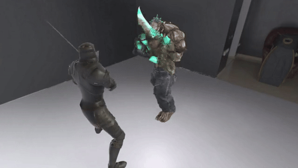

This is a sample Unity project including animated characters. STYLY spatial layer plugin has been installed in this project already. So you can just open the Unity scene, create a Prefab and upload it to STYLY for Vision Pro.